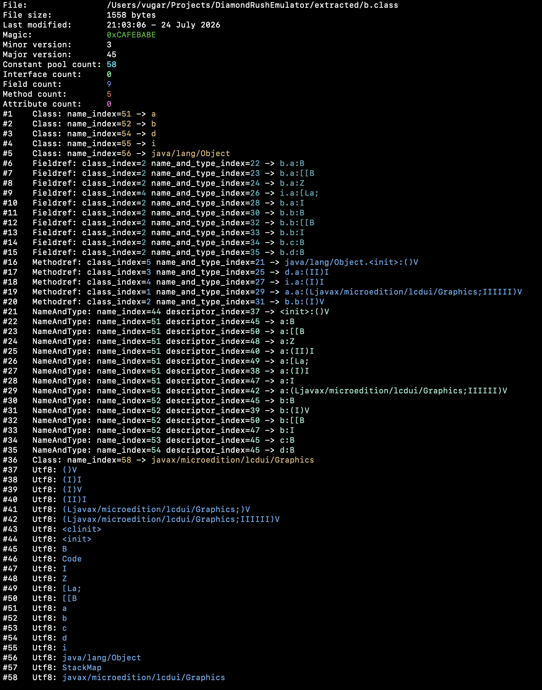
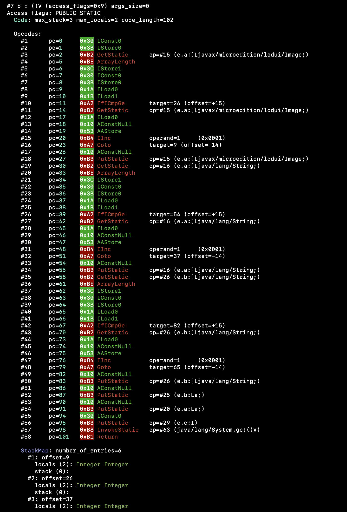

# DRVM

DRVM (Diamond Rush Virtual Machine) is a custom Java Virtual Machine (JVM) implementation for reverse engineering the iconic J2ME game **Diamond Rush**.


## What it does

Right now, this project can replicate the behaviour of `javap`, the Java class file disassembler. Funnily enough, drvm's disassembler works way faster than the original Java implementation, thanks to C++'s performance advantages. 

Additionally, it can currently execute roughly half of the JVM opcodes. Nonetheless, the VM part is still a work in progress. The main goal of this project is to be able to run the original game on modern platforms, such as Linux and macOS. 

## Future Plans

Once the VM is fully functional on Linux and macOS (hopefully), I plan to port it and its graphics backend to a variety of popular microcontroller platforms, such as the ESP32 and RP2040/RP2350.

# To build the project:
``` bash
mkdir build
cd build
cmake ..
make
```
> Note: The project does not use any external libraries yet.

# How to use the disassembler

After building DRVM, you can use it to inspect a Java `.class` file directly from the command line.

For example: 

``` bash
./drvm  path/to/class/file.class
```

The repo already contains extracted contents of the game's `.jar ` file. 

You can access the extracted `.class`  files from the build directory like this:

``` bash
./drvm  ../extracted/a.class
```

## Constant pool dump
<br>
<p align="center">
  
</p>

## Methods dump
<p align="center">
  
</p>
