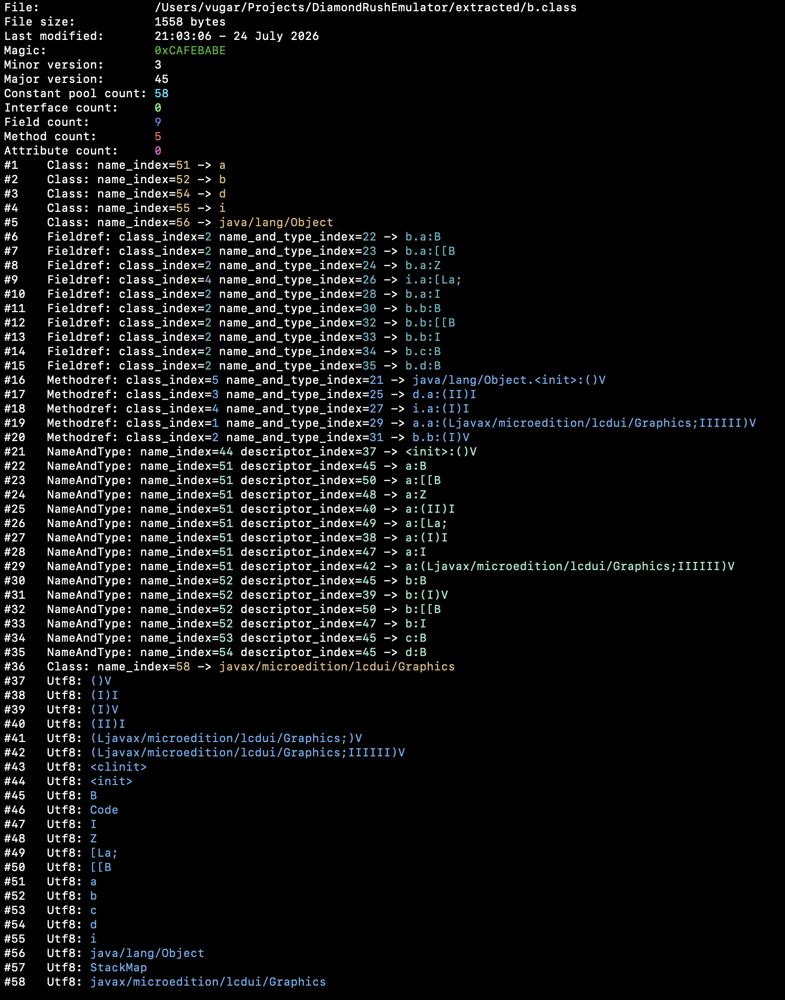
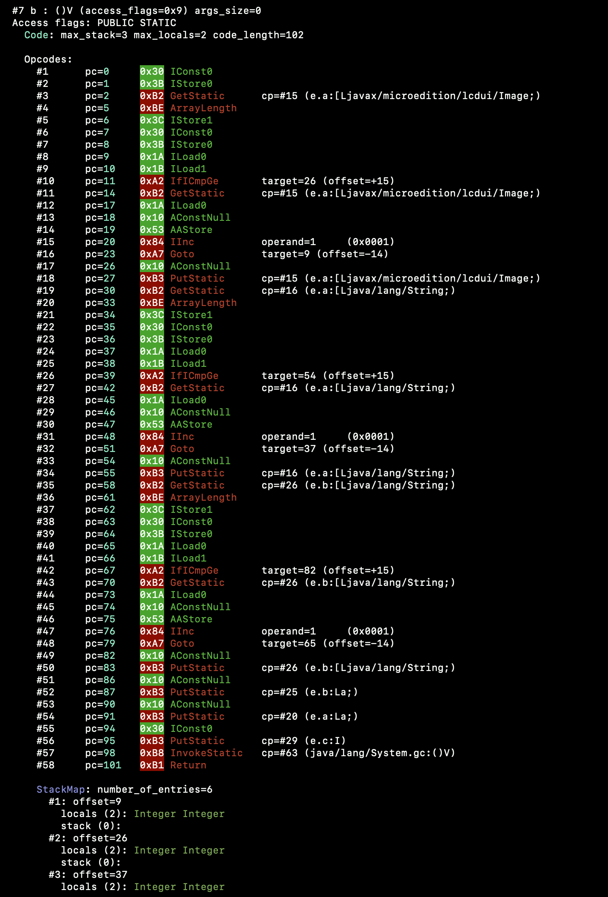

# DRVM

DRVM (Diamond Rush Virtual Machine) is a custom J2ME JVM and full Java class-file disassembler written in pure C++, built for reverse engineering and analysing the iconic J2ME game Diamond Rush. Supports Java class files in general, beyond its J2ME focus.

## Why?

I used to play Diamond Rush on my BlackBerry phone when I was a child. As I grew older and became accustomed to embedded systems and systems engineering, I became obsessed with small programs and devices that can do fairly complex things. I adopted the principle that “simpler is better” as one of the main principles I use when approaching certain problems.

Looking back, I remembered how old games could be so simple yet beautiful. I wanted to create a way for me to experience Diamond Rush again through my own effort, and DRVM grew out of that idea.

What started as a project focused solely on the game Diamond Rush has grown into something more general in the Java world. Its disassembler can disassemble any Java class file, while the VM can currently execute programs as long as they do not require external libraries. I am happy with the current state of the project and with the direction it is going.

## What it does

Right now, the project can replicate the full behaviour of javap, the Java class file disassembler, and it is roughly 4 times faster and uses 30 times less memory! Big thanks to C++'s performance advantages.

Additionally, the VM can currently execute any Java class file if it does not call any additional external libraries. The VM side is still a work in progress, however. The main goal of the project is to eventually run the original Diamond Rush game on modern platforms such as Linux and macOS and on microcontrollers, if possible.


# To build the project

```bash
cmake -B build
cmake --build build
```

> Note: The project does not use any external libraries yet.

# How to use the disassembler

After building DRVM, you can use it to inspect a Java `.class` file directly from the command line.

For example:

```bash
./drvm path/to/class/file.class --dump
```

The repo already contains the extracted contents of the game's `.jar` file.

You can access the extracted `.class` files from the build directory like this:

```bash
./drvm ../extracted/a.class --dump
```

# Running Java class files

To run any Java class file:

```bash
./drvm path/to/class/file.class --run
```

To get a trace of the executed opcodes:

```bash
./drvm path/to/class/file.class --run --trace
```


## Constant pool dump
<br>
<p align="center">
  
</p>

## Methods dump
<p align="center">
  
</p>
